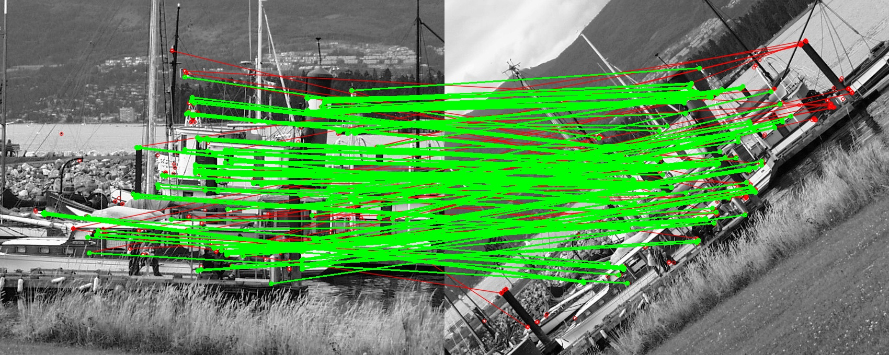

# BEBLID: Boosted Efficient Binary Local Image Descriptor
This repository contains the source code of the BEBLID local image descriptor




## Dependencies

The code depends on OpenCV 4. To install OpenCV in Ubuntu 18.04 you can download it using apt-get:

```shell script
sudo apt-get install libopencv-dev
```

Or compile it from sources:

```shell script
# Install dependencies (Ubuntu 18.04)
sudo apt-get install -y build-essential cmake git libgtk2.0-dev pkg-config libavcodec-dev libavformat-dev libswscale-dev
# Download source code
git clone https://github.com/opencv/opencv.git --branch 4.1.0 --depth 1
# Create build directory
cd opencv && mkdir build && cd build
# Generate makefiles, compile and install
cmake -D CMAKE_BUILD_TYPE=RELEASE -D CMAKE_INSTALL_PREFIX=/usr/local ..
make -j$(nproc)
sudo make install
```

## Compile and Run

With the BEBLID descriptor code we provide a small demo to register a pair of images. 
The demo detects feature points using ORB detector (FAST + Harris score) and describes using BEBLID. 

The code can be compiled with Cmake:

```shell script
mkdir build && cd build
cmake .. && make
./beblid_demo
```

The result for the provided images should be several imshows and something like this in the standard output:

```
Detected  500 kps in image1
Detected  500 kps in image2
Points described
Number of matches: 228
Number of inliers 181 ( 79.386% )

Process finished with exit code 0
```

## References

If you use this code, please cite our Pattern Recognition Letters paper:

**TODO**
